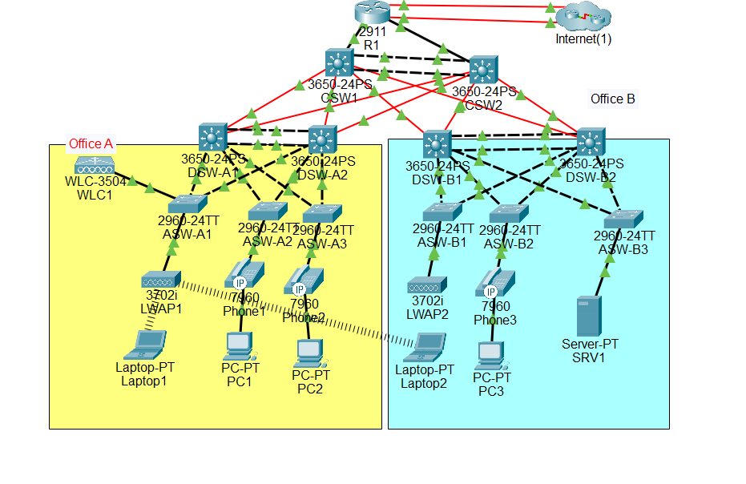

# Two-Site Enterprise Campus Network — MegaLab

A collapsed-core/distribution/access enterprise network built end-to-end in Cisco Packet Tracer, modeling two office sites joined by a shared Layer-3 core with dual-ISP internet redundancy, centralized wireless, VoIP, and layered security.



## Overview

This is a 29-device, two-site campus build (**Office A** and **Office B**) following a classic three-tier hierarchy — core, distribution, access — with a dual-homed internet edge. It was designed to demonstrate realistic enterprise redundancy, segmentation, and hardening rather than just basic connectivity: OSPF, HSRP, and Spanning Tree are all explicitly tuned to agree with each other so failover is fast and traffic never takes an inefficient path.

Full write-up of every design decision — addressing plan, routing, redundancy, security — is in [`docs/technical-documentation.md`](docs/technical-documentation.md).

## Key Technologies

- **Routing:** OSPF (single area), point-to-point network types, dynamic + floating static default routes
- **Redundancy:** HSRP load-sharing (active gateway alternated per VLAN), LACP EtherChannel core/distribution uplinks
- **Segmentation:** Per-site VLANs (data/voice/wireless/management), 802.1Q trunking, non-default native VLAN, DTP disabled
- **Spanning Tree:** Rapid PVST+ root priorities aligned with HSRP active roles to prevent traffic tromboning
- **Internet Edge:** Dual-ISP edge router, NAT/PAT + static 1:1 NAT, IPv6 dual-stack (EUI-64), anti-spoofing ingress ACLs
- **Services:** Centralized DHCP/DNS (IP-helper relays, Option 43 for AP discovery), syslog, SNMP, NTP (MD5-authenticated)
- **Wireless & VoIP:** Centralized WLC managing CAPWAP-based APs across both sites, voice-VLAN-tagged IP phones
- **Security:** DHCP snooping, Dynamic ARP Inspection, port security, SSHv2-only management with local AAA, VTY access-class restrictions

## Repository Structure

```
megalab-enterprise-campus-network/
├── README.md
├── megalab.pkt                     # Open with Cisco Packet Tracer 8.x+
├── docs/
│   ├── topology-diagram.png
│   └── technical-documentation.md  # Full design documentation
└── LICENSE
```

## Requirements

- [Cisco Packet Tracer](https://www.netacad.com/courses/packet-tracer) 8.x or later to open `megalab.pkt`

## Credits

Built with [Musab Ahmad](https://www.linkedin.com/in/musabahmad/) — his collaboration and contributions were a core part of the design.

## License

MIT — feel free to use this as a reference or teaching aid.
